# AWS API Gateway Assessment

This repository contains an infrastructure-as-code deployment for a serverless API hosted on AWS. It provisions an API Gateway for two distinct AWS Lambda functions (TypeScript and Python) and includes automated deployment and testing pipelines.

For API service seletion I chose Google Books API for the TypeScript lambda and
GitHub REST API for the Python lambda. I made these selections based on a rudimentary scenario I gave myself for the assessment where group reading activity is tracked in a shared git repo. The users want an app that can check recent reading activity and then look up a bit of information about the books people are reading. The lambdas could be a small part of that solution.

## Repository Structure

**Assessment Note:** For simplicity I intentionally stuck with the directory and lambda
function file names as described in the assessment instructions, in case they were intended as hard reqs. Under other circumstances I would use naming that matches the utility of each function.

```
/aws-api-gateway-assessment
├── README.md
├── assets
├── docs
├── cloudformation
│   ├── main.yaml - main cloudformation script
├── lambdas
│   ├── lambda1
│   ├── lambda2
```

- `assets/`: configuration and automation scripts
- `docs/`: dev notes and additional documentation
- `cloudformation/: CloudFormation scripts
- `lambdas/lambda1`: TypeScript Lambda integrating with the Google Books API.
- `lambdas/lambda2`: Python Lambda integrating with the GitHub API.

## Prerequisites

To deploy and test this project locally, ensure you have the following installed:

- AWS CLI (configured with active credentials, see [AWS CLI Authentication](#aws-cli-authentication-sso-setup))
- Node.js
- `pnpm`
- Python 3.13+
- `uv`
- `jq`

#### AWS CLI Authentication - SSO Setup

Before creating your S3 bucket or running the deployment scripts, your terminal must be authenticated with AWS. If you are using AWS IAM Identity Center (SSO), follow these steps to ensure the CLI and scripts use the correct credentials:

1. Configure your SSO profile (if not already set up)

   ```bash
   aws configure sso
   ```

   Follow the prompts to enter your SSO Start URL, Region, and select your target account and role. Once complete, the CLI will output the name of your newly created profile (e.g., `AdministratorAccess-123456789012`).

2. Set your active AWS profile
   Export your profile name to the current shell environment. This ensure that subsequent AWS CLI commands and deployment scripts run from this shell route to the correct account:

   ```bash
   export AWS_PROFILE=<YOUR-PROFILE-NAME>
   ```

3. Authenticate

   ```bash
   aws sso login
   ```

   This will open a browser window to confirm your authorization. Once the terminal displays "Successfully logged in", you are ready to proceed.

## Configuration

This repo separates public infrastructure config vars and private secrets.

1. **Create an S3 bucket**

   AWS CloudFormation requires an existing S3 bucket to store the packaged Lambda deployment zips. If you already have an S3 bucket that you will be using you can skip to the next step.

   To create a globally unique S3 bucket using the AWS CLI:

   ```bash
   aws s3 mb s3://<GLOBALLY-UNIQUE-BUCKET-NAME>
   ```

2. **Public Infrastructure Config - `assets/config.sh`**

   This file contains non-sensitive variables and is committed to version control.

   Open `assets/config.sh` and update the `S3_BUCKET` variable to match the exact name of the S3 bucket you will be using (a previously existing bucket or the one you created in the previous step).

3. **Private Secrets - `.env`**

   You _must_ create a `.env` file in git root. This file is ignored by git. The file _must_ contain the following keys:

   ```env
   GOOGLE_BOOKS_API_KEY=<your_google_api_key>
   GITHUB_TOKEN=<your_github_personal_access_token>
   TEST_USER_PASSWORD=<your-complex-password-for-cognito-test-user>
   ```

   **Google Books API Key:** See the official documentation for how to
   [aquire an API key for Google Books](https://developers.google.com/books/docs/v1/using#APIKey)

   **GitHub Token:** You can use either a [Classic](https://docs.github.com/en/authentication/keeping-your-account-and-data-secure/managing-your-personal-access-tokens#creating-a-personal-access-token-classic) or [Fine-Grained](https://docs.github.com/en/authentication/keeping-your-account-and-data-secure/managing-your-personal-access-tokens#creating-a-fine-grained-personal-access-token) Personal Access Token. The Lambda that uses it only queries public repository activity and the token is strictly utilized to prevent rate-limiting from GitHub.

   **Cognito test user:** You may encounter errors if the value for `TEST_USER_PASSWORD` contains a `!` character. The test user is created using a dummy email address when `assets/test-enpoints.sh` is run, either directly or via other scripts.

4. **Auotmation Scripts**

   For quality of life, this repo uses bash automation scripts stored in the `assets/` directory as well as the `deploy-full.sh` script at gitroot. Ensure that each script has the execution bit enabled by using `chmod +x foo`.

## Deployment

The entire stack can be built, packaged, deployed, and tested using the provided wrapper script:

```bash
./deploy-full.sh
```

## Teardown

To delete the deployed stack from AWS:

```bash
aws cloudformation delete-stack --stack-name api-assessment-stack &&
aws cloudformation wait stack-delete-complete --stack-name api-assessment-stack
```

To delete the S3 bucket, if you created one specifically for this assessment:

```bash
aws s3 rb s3://<BUCKET-NAME> --force
```

## Architecture & Design Decisions

```mermaid
flowchart LR
    %% Flow
    Client([Client / REST Client])

    subgraph AWS_Cloud ["AWS Cloud"]
        direction TB

        subgraph Security_Layer ["Security & Identity"]
            Cognito[(Amazon Cognito)]
            IAM1{{IAM: LibrarySearch}}
            IAM2{{IAM: GitHubActivity}}
        end

        subgraph Compute_Layer ["Serverless Backend"]
            APIGW[AWS API Gateway]

            subgraph Lambda_Functions ["Lambda Functions"]
                L1[Lambda: Node.js/TS]
                L2[Lambda: Python 3.13]
            end
        end
    end

    subgraph External_APIs ["External Services"]
        direction LR
        GBooks[Google Books API]
        GHub[GitHub REST API]
    end

    %% Connections
    Client -->|HTTPS + Token| APIGW
    APIGW <-->|Authorize| Cognito

    APIGW <-->|/books| L1
    APIGW <-->|/activity| L2

    IAM1 -.->|Assumes| L1
    IAM2 -.->|Assumes| L2

    L1 <-->|REST + API Key| GBooks
    L2 <-->|REST + PAT| GHub

    %% Styles
    style AWS_Cloud fill:#999,stroke:#ff9900,stroke-width:2px
    style Security_Layer fill:#777,stroke:#dd0000,stroke-dasharray: 5 5
    style External_APIs fill:#444,stroke:#0000CC ,stroke-width:1px
```



### CloudFormation

The Cognito User Pool, User Pool Client, and API Gateway authorizers are automated and provisioned via the CloudFormation template. No manual AWS console config is required.

There are also distinct IAM roles, `GitHubActivity` and `LibrarySearch`, that are assigned to the respective lambdas.

### Lambdas - `lambdas/`

Each lambda has a self-contained environment and dependency config for its particular language and reqs.

#### TypeScript Lambda - `lambdas/lambda1`

This lambda integrates with the Google Books API and requires a Google API key. The lambda provides an endpoint (/books) for finding books by title. Data fetched from Google Books are limited to 5 books ("volumes") and are processed so that only a subset of the available metadata are returned through the endpoint.

This lambda can be built for AWS from git root by running `./assets/build-ts.sh`

Additionhal info:

- package management using `pnpm`
- compiled using `npx tsc`
- unit tested with `jest`

#### Python Lambda - `lambdas/lambda2`

This lambda integrates with the GitHub RESAT API and requires a GitHub Personal Access Token. The lambda provides an endpoint (/activity) for finding the latest commit history from specified GitHub repository. Data fetched from GitHub are limited to the last 10 commites and are processed so that only a subset of the available metadata are returned through the endpoint.

This lambda can be built for WAS from git root by running `./assets/build-py.sh`

Additionhal info:

- package management using `uv`
- unit tested with `pytest`

## Testing

### Unit Tests

Both Lambda functions are unit tested to validate successful data mapping, missing query parameters, external API errors, and global exception handling.

To run all unit test, run `./unit-tests-full.sh` from git root.

To manually run jest test for lambda1:

```bash
cd lambdas/lambda1
pnpm install
pnpm test
```

To manually run pytest for lambda2:

```bash
cd lambdas/lambda2
uv sync
uv run pytest
```

### Deployed API Integration Tests

Once the stack is deployed, you can execute the integration tests directly to verify API Gateway, Cognito authentication, and the Lambda integrations. The script automatically fetches the dynamic API URL and Client ID directly from the CloudFormation stack outputs, authenticates the test user, and fires requests at both endpoints. Note that this test also runs automatically when `./deploy-full.sh` runs.

```bash
./assets/test-endpoints.sh
```

## Endpoint Details & Sample Requests

The API Gateway requires a valid Cognito ID token passed in the `Authorization` header for all requests. The CloudFormation stack automatically provisions the necessary User Pool and Authorizer.

#### 1. Google Books Search (`/books`)

**Method:** `GET`
**Query Parameters:** \* `q` (required): The title of the book to search for.

**Sample Request:**

```bash
curl -X GET "https://<YOUR_API_ID>.execute-api.<REGION>.amazonaws.com/prod/books?q=permutation+city" \
     -H "Authorization: Bearer <YOUR_COGNITO_ID_TOKEN>"
```

**Expected Response (200 OK):**

```json
{
  "results": [
    {
      "id": "-VU0AgAAQBAJ",
      "title": "Permutation City",
      "authors": ["Greg Egan"],
      "isbn": "9780575105454"
    },
    {
      "id": "RzY4mwEACAAJ",
      "title": "City Permutation",
      "authors": ["Gunho Kim"],
      "isbn": null
    }
  ]
}
```

_(Note: Response truncated for brevity. The API returns up to 5 volumes.)_

#### 2. GitHub Repository Activity (`/activity`)

**Method:** `GET`
**Query Parameters:** \* `repo` (required): The target repository in `owner/repo` format.

**Sample Request:**

```bash
curl -X GET "https://<YOUR_API_ID>.execute-api.<REGION>.amazonaws.com/prod/activity?repo=torvalds/linux" \
     -H "Authorization: Bearer <YOUR_COGNITO_ID_TOKEN>"
```

**Expected Response (200 OK):**

```json
{
  "results": [
    {
      "sha": "c369299",
      "author": "Linus Torvalds",
      "message": "Linux 7.0-rc5",
      "date": "2026-03-22T21:42:17Z"
    },
    {
      "sha": "ec69c9e",
      "author": "Mikko Perttunen",
      "message": "i2c: tegra: Don't mark devices with pins as IRQ safe",
      "date": "2026-03-03T04:32:11Z"
    }
  ]
}
```

_(Note: Response truncated for brevity. The API returns up to 10 recent commits.)_
